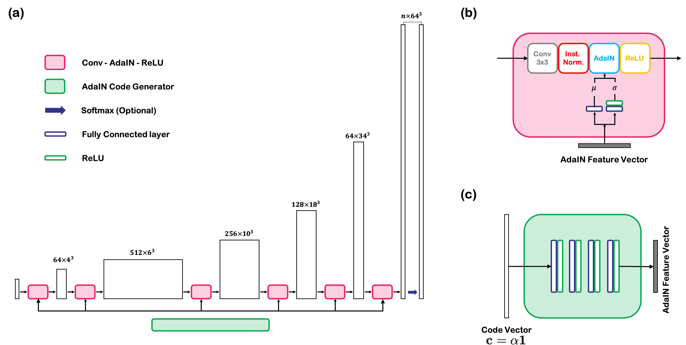

# SliceGAN_AdaIN

[](https://zenodo.org/badge/latestdoi/381998830)

This repository is the official codebase for "Reusability Report: Feature Disentanglement in generating three-dimensional structure from two-dimensional slice with sliceGAN", which is a reusability report on this [paper](https://www.nature.com/articles/s42256-021-00322-1). Implemented codes are heavily based on the [original implementation of SliceGAN](https://github.com/stke9/SliceGAN), which is extended to enable feature disentanglement via Adaptive Instance Normalization (AdaIN).

Slight modifications were made to the original python files, and hence the ```.py``` files were renamed to
e.g.```run_slicegan_disentangle.py, model_disentangle.py```. The docstrings in the functions that were newly implemented
are now marked with ```Used for SliceGAN-AdaIN```.

The developmental version of the code was tested on the following environment

- ubuntu 18.04, CUDA 10.2
- pytorch 1.7.1 + cudatoolkit=10.2

If you have any issues with running the code, please contact me at [hj.chung@kaist.ac.kr](hj.chung@kaist.ac.kr)

### Network Implementation



### Results


### Preparation

You can

1. Download pre-trained model weights
2. Download data for training
3. Install dependencies e.g.pytorch, jupyter notebook env

via

```
source ./install.sh
```

### Testing

Run the following command
```
python run_slicegan_disentangle.py 0
```
Note that you can change the python list ```codes``` inside the python script, to control the grain size. Test code will generate the volumes given the code in the codes list while fixing the random noise vector values.

By running the scripts, the volumes generated with the given ```codes``` will be saved as ```.np``` files. To visualize how
each volumes look, we provide minimal jupyter notebook example

```
visualize_results.ipynb
```

### Training

Run the following command
```
python run_slicegan_disentangle.py 1
```

----------

### References

1. Kench, Steve, and Samuel J. Cooper. "Generating three-dimensional structures from a two-dimensional slice with generative adversarial network-based dimensionality expansion." *Nature Machine Intelligence* (2021): 1-7.
2. Hsu, Tim, et al. "Mesoscale characterization of local property distributions in heterogeneous electrodes." *Journal of Power Sources* 386 (2018): 1-9.

